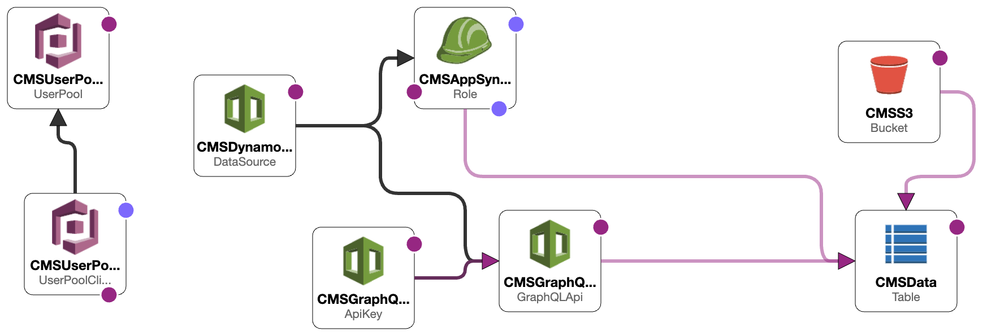

# U(gly)CMS
Basic CMS created using Next.js and various AWS services

# How it works
### Services Used
- CloudFormation
- Cognito
- AppSync
- DynamoDB
- IAM

##
- Resources deployed using **AWS Cloudformation**
- User authentication is handled by **AWS Cognito**
- **AWS DynamoDB** tables hold data for each model
- **AWS AppSync** used to query and update DynamoDB tables
- **AWS IAM** used to provide AppSync permission to interact with DynamoDB tables

## Design

# Tasks
- [x] Cognito Auth
- [x] Create Model
- [ ] Edit Model
- [ ] Expose GraphQL API
- [ ] Styling